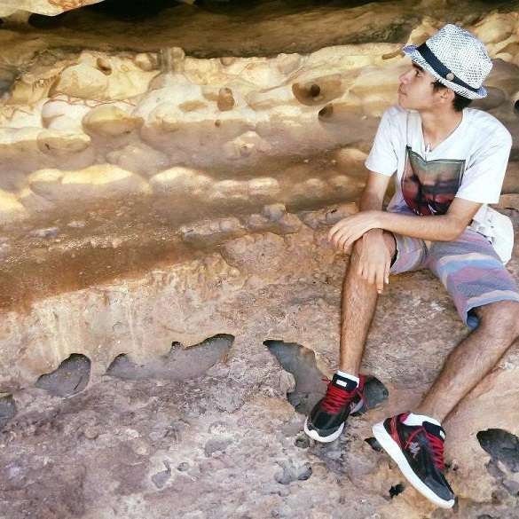
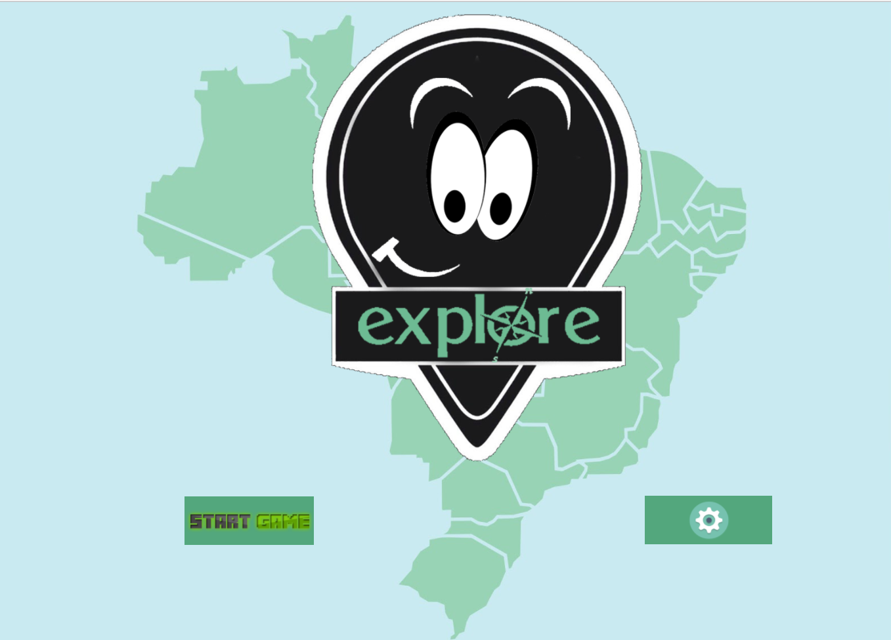
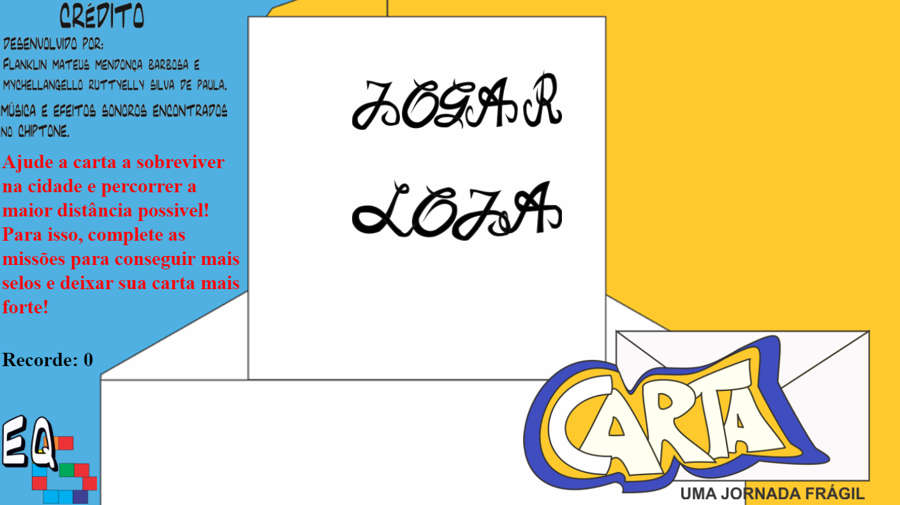
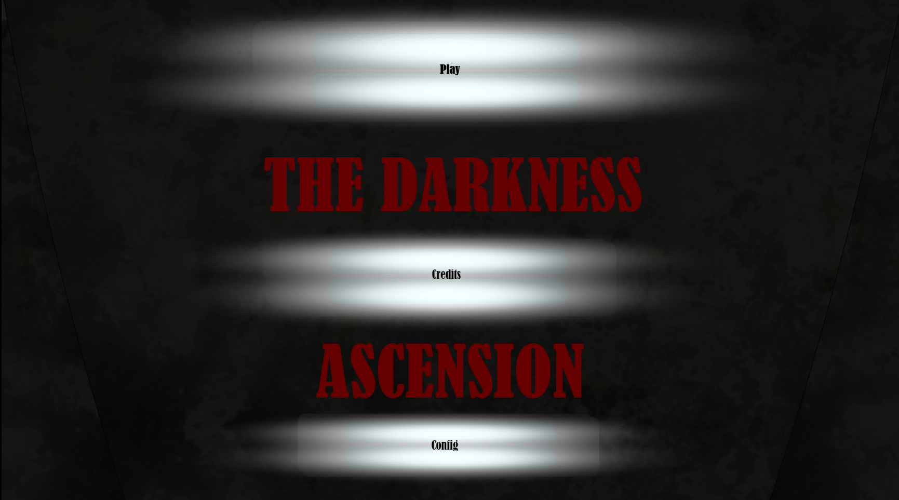

---  
layout: default
---  
* * *
# **Quem sou eu** ?  
 * * *  
 **Meu nome é**  
 Franklin Mateus Mendonça Barbosa  
  
 **O que eu faço**  
 Desenvolvo jogos digitais. Minhas principais experiências são com programação, level design e game design.  
 **Contatos**  
 Email - fmateus12316@gmail.com  
 WhatsApp - 99194-6023  
 * * *  
# **Produções**  
 * * *  
 1. Explore  
 <dt> Um jogo educativo em que o jogador explora as 5 regiões do Brasil na companhia de um GPS e deve coletar itens especificos de cada uma antes que a bateria do GPS acabe. E ai, será que você consegue?</dt>  
   
 1. Carta: uma jornada frágil  
 <dt> Um jogo de corrida infinita em que o jogador deve controlar uma frágil e "indefesa" carta em sua jornada pela cidade. Por quanto tempo você conseguirá mante-la inteira?</dt>  
    
 1. The Darkness Ascension  
 <dt> Encontre a saída de um hospital macabro resovendo puzzles dos mais diversos. E cuidado com a sombra...</dt>  
   
 * * *  
# **Games**  
 * * *  
 1. [Explore](https://thewordkh.github.io/Explore/)  
 2. [Carta: uma jornada frágil](https://mychellangello.github.io/Carta%20uma%20jornada%20fr%C3%A1gil/)  
 3. [The Darkness Ascension](https://guiegle.github.io/tda2/)  
 * * *  
# **Apresentações**  
 * * *  
 * * *  
