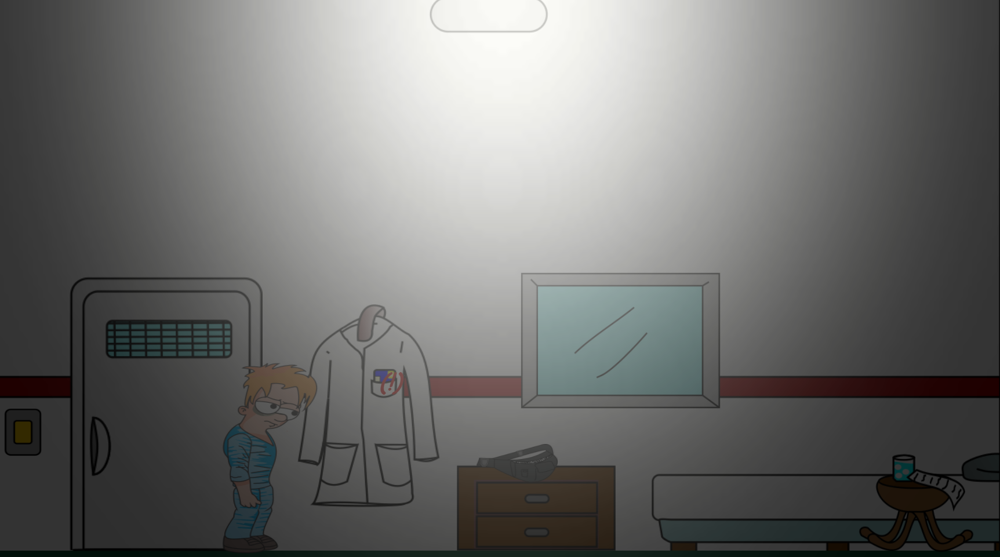
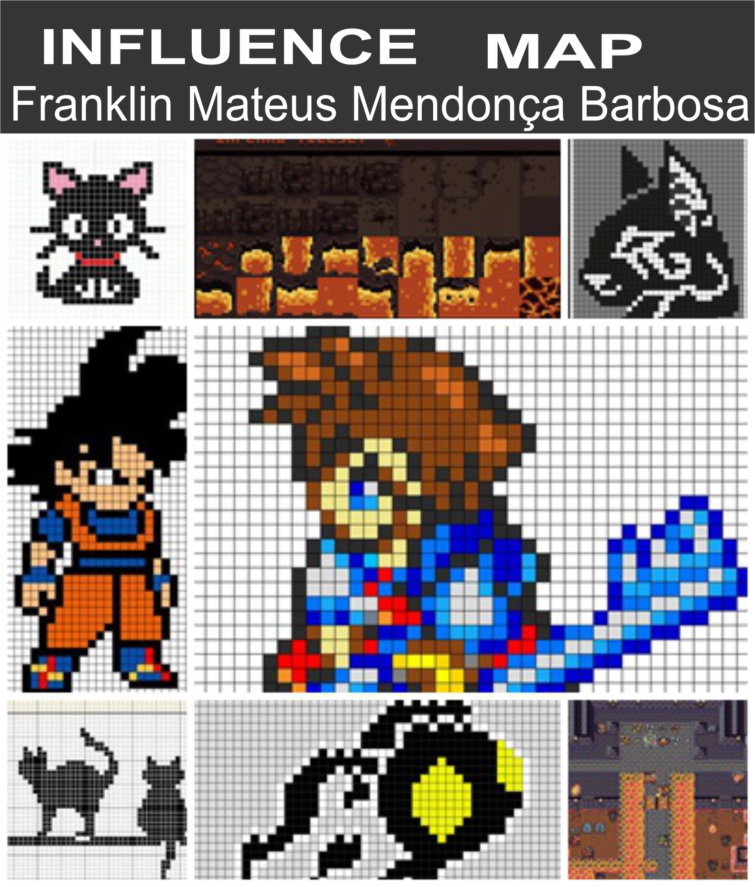
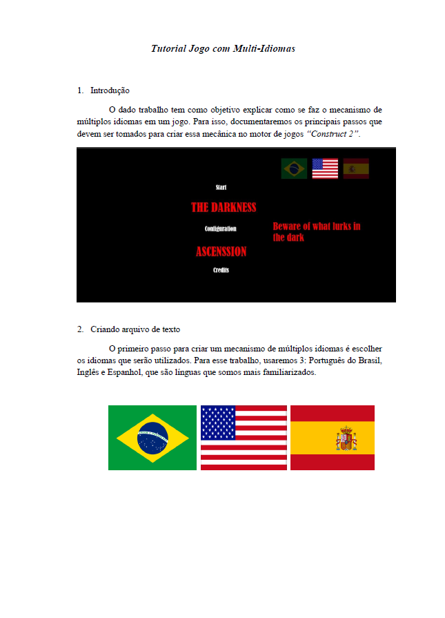
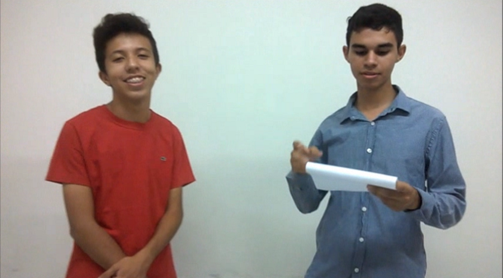

---  
layout: default
---  
* * *
# **Quem sou eu?**  
 * * *  
 **Meu nome é**  
 Franklin Mateus Mendonça Barbosa  
   
   
 **O que eu faço**  
 Desenvolvo jogos digitais. Minhas principais experiências são com programação, level design e game design.  
   
 **Do que eu gosto**  
 Sou muito eclético em se tratando de música. O mesmo para a parte de jogos. No universo dos jogos digitais, gosto dos generos RPG, plataforma e hack'n slash. Leio de tudo um pouco, mas temnho uma paixão pela ficção. Adoro o universo cinematográfico, em especial no que se trata de enredo e direção. Gosto também de escrever histórias fantasticas.  
   
 **Contatos**  
 Email - fmateus12316@gmail.com  
 WhatsApp - 99194-6023  
 * * *  
# **Portifólio**  
 * * *  
 1. Explore   
 <dt> Um jogo educativo em que o jogador explora as 5 regiões do Brasil na companhia de um GPS e deve coletar itens especificos de cada uma antes que a bateria do GPS acabe. E ai, será que você consegue?</dt>  
   
   
 1.1 Carta: uma jornada frágil  
 <dt> Um jogo de corrida infinita em que o jogador deve controlar uma frágil e "indefesa" carta em sua jornada pela cidade. Por quanto tempo você conseguirá mante-la inteira?</dt>  
   
   
 1.2 The Darkness Ascension  
 <dt> Encontre a saída de um hospital macabro resovendo puzzles dos mais diversos. E cuidado com a sombra...</dt>  
   
   
 * * *  
# **Outros projetos**  
 * * *  
 <dt>Esse espaço é dedicado a outros trabalhos que eu realizei</dt>  
   
 **Influence Map**  
   
   
 **Tutorial: Mudança de idioma em jogo**  
   
 <dt>Esse tutorial mostra como se faz a mecânica da troca de idiomas na plataforma Construct 2. O arquivo em pdf você encontra clicando na palavra abaixo.</dt>  
  [Tutorial](https://drive.google.com/drive/folders/1Zqxi_FV_hpynoAsTZwkTcW0PgUwz1F4s?usp=sharing)  
  
 **Olimpiadas News**  
   
 <dt> Trabalho da disciplina de Educação Física em que foi elaborado um vídeo critícando a Olimpiada do Rio de 2016. O vídeo você acessa clicando na palavra abaixo.</dt>  
 [Olimpiadas news](https://drive.google.com/drive/folders/1BJBUDYSKTq8kSWGCmlBnuuzvXSpI63Rz?usp=sharing)  
 * * *  
   
   
#### **"O impossível só existe para quem acredita na impossibilidade! Basta querer intensamente!"(Fernão Capelo Gaivota)**  
  
**Portfólio criado para a disciplina de Motores**  

  
* * *  
